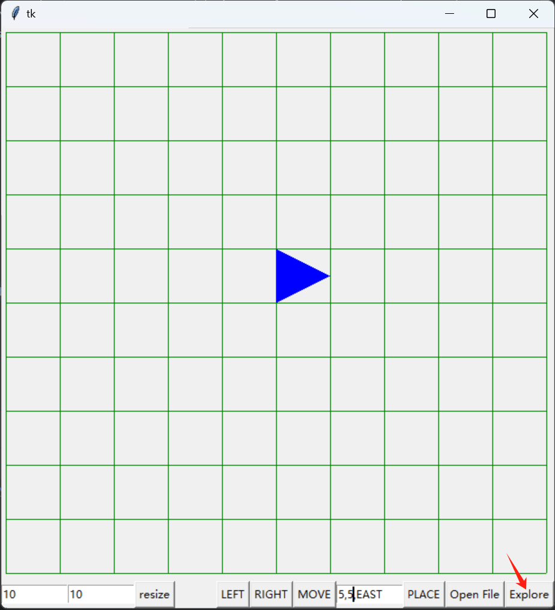

# Toy Robot Simulator

This is a service for Toy Robot Simulator.

### Preparation

- Python 3.x environment
- install Python packages:

  ```pip install -r requirements.txt```

### To run this project(V2, UI version)

The robot is free to roam around the surface of a table, Key features of this release:

- A simple UI interface.
- Support the following commands:
    - PLACE X,Y,F: put the toy robot on the table in position X,Y and facing NORTH, SOUTH, EAST or WEST.
    - MOVE: move the toy robot one unit forward in the direction it is currently facing.
    - LEFT and RIGHT: rotate the robot 90 degrees in the specified direction without changing the position of the robot.
    - REPORT: announce the X,Y and F of the robot.

      

- The robot can be controlled by the keyboards:
    - LEFT(LEFT)
    - RIGHT(RIGHT)
    - UP(MOVE)

- The size of the table can be changed by the user.

  

- The robot can load the command from a file.

  

- Automatic exploration by algorithm of Traveling Salesperson Problem.

  
  
  
  
  
  

### To run this project(V1, script version)

key features:

- The robot is free to roam around the surface of a table, of dimensions 5 units x 5 units.
- Support the following commands:
    - PLACE X,Y,F: put the toy robot on the table in position X,Y and facing NORTH, SOUTH, EAST or WEST.
    - MOVE: move the toy robot one unit forward in the direction it is currently facing.
    - LEFT and RIGHT: rotate the robot 90 degrees in the specified direction without changing the position of the robot.
    - REPORT: announce the X,Y and F of the robot.

- run the script by standard input (Please note that the place command needs to be surrounded by parentheses.)
  ```
  python robot.py "PLACE 0,0,EAST" MOVE MOVE REPORT
  ```
- run the script by a file
  ```
  python robot.py -f ../data/a.txt
  ```

#### Configuration

Currently, the size of the table can be changed by the instantiation method: Robot(length=5, width=5).

#### Test Case

There are several files in data folder.

- a.txt: example a
- b.txt: example b
- c.txt: example c
- round.txt: robot run from southeast corner(0,0) to other 3 corners.
- report.txt: report positions
- first_valid_place.txt: The first valid command to the robot is a PLACE command,
  after that, any sequence of commands may be issued, in any order, including another PLACE command.
  The application should discard all commands in the sequence until a valid PLACE command
  has been executed.
- fall_off.txt: Any move that would cause the robot to fall must be ignored.

### Future Plan

- Support obstacles on the table.
- Support multiple robots on the table.
- Provide multiple algorithms for robot exploration.
- Support the robot to learn from the environment.
